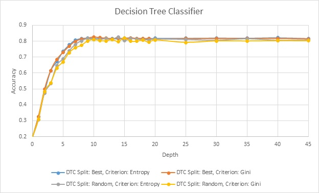
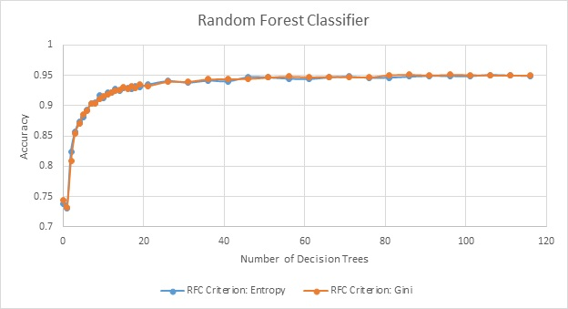
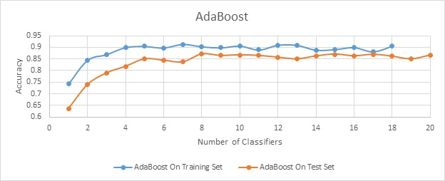
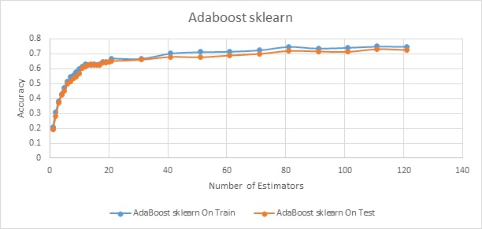

# Decision Trees and Ensemble Classifiers
### on MNIST

### Decision Tree Classifier

 Decision tree learning is a non-parametric supervised method where the prediction is made based on a set of decision rules inferred from the data. There is generally no notion of distance measures here and are thought to be best in general.

Here we apply the decision tree classifier on the MNIST data set which has preprocessed to extract a training set of equally distributed classes with 10000 data points. The testing has been performed on a equally distributed set of size 1000.

</img>

The decision rules are made based on an information gain function and here the experimentation has been done on two such functions, gini and entropy. The two seem to work well.

Also a very notable feature of the above experiment is the variation of accuracy with increasing depth of the tree.
The split set at every node also could be varied as a best split or any random split.

In general for this data set decision trees max out at an accuracy of 0.8

### Random Forest classifier

 RFC is a collection of multiple decision trees. The prediction is based on a probabilistic estimate of all the trees in the forest! So we have a parameter to tune.

 </img>

 Again we see the steep increase of accuracy with increasing number of trees maxing out at 0.95 for ~50 trees. Here we allowed the trees to expand fully.

### AdaBoost

 Adaboost is an algorithm to boost the performance of weak classifiers. Together all the classifiers will improve the accuracy of the prediction. The weak classifiers are generally decision trees of small depth.

 </img>

 This version of Adaboost was built from scratch by using decision trees of depth 10 with a random split.

As was expected the test set performance is a bit lower over the validation set.

The set maxes out at 0.9 for 5 weak classifiers, with a test set accuracy of 0.85 for the same.

Note: This implementation takes a lot more time than the sklearn implementation.

### Adaboost - sklearn

 Apparently sklearn can do all the work of boosting directly. The accuracy of this method is a bit lower compared to a from-scratch implementation. This can be attributed to the size 10 trees in the previous method, which aren’t truly weak.

 </img>

 For this the accuracy maxes at 0.7 for ~85 classifers and the test performance for the same is 0.7

### Note:
 The feature descriptor used here are HoG descriptors. 
